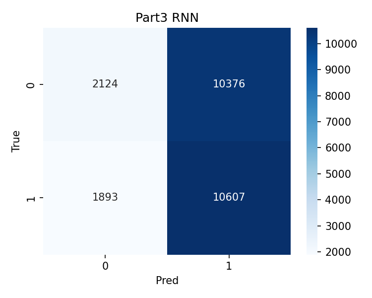
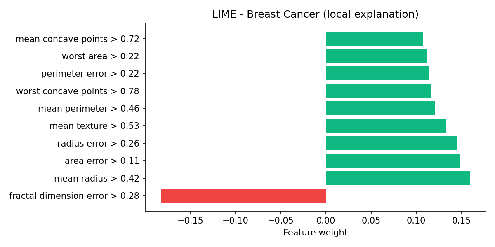
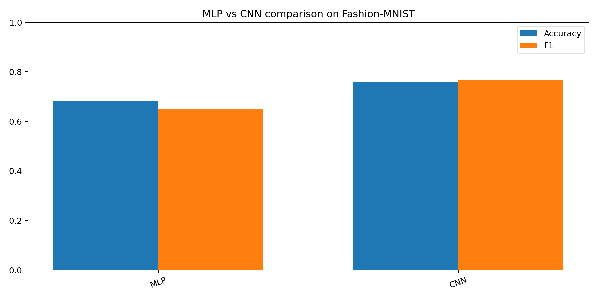
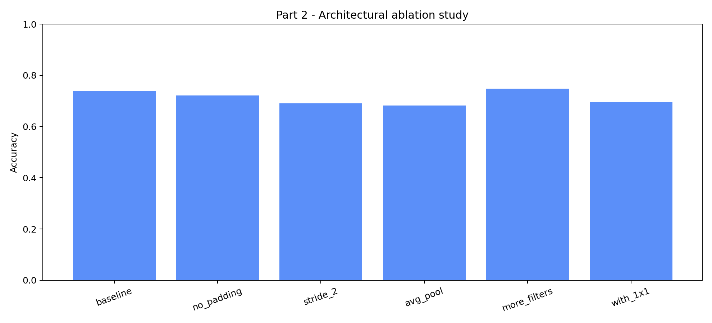
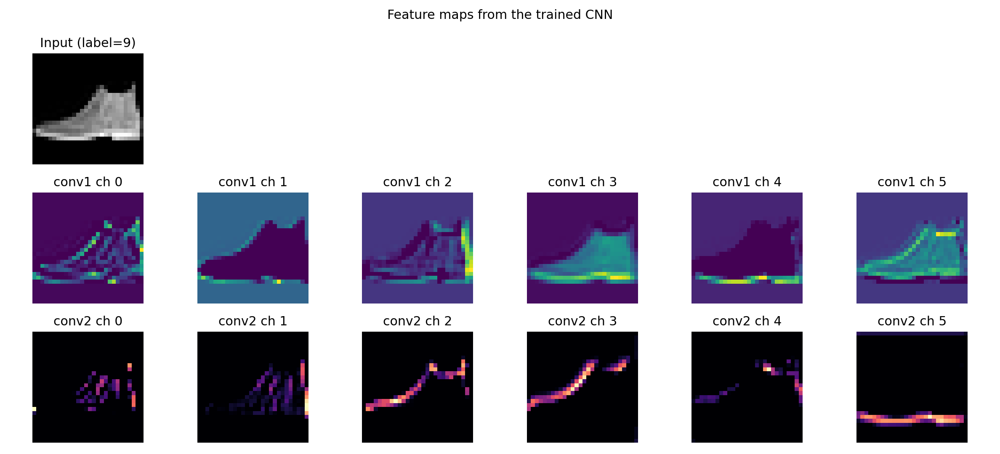
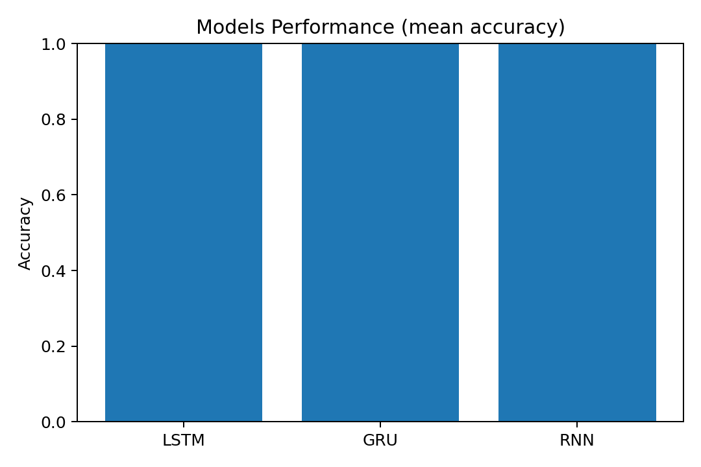
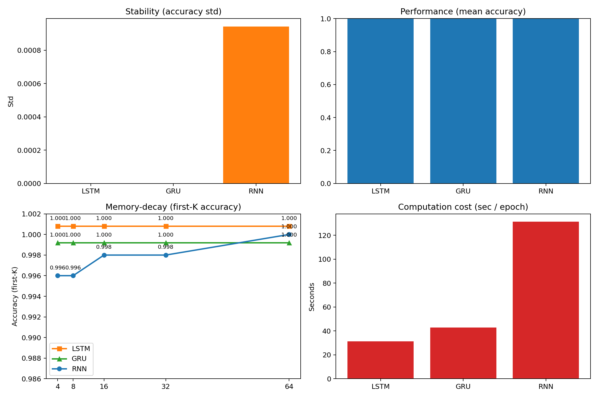
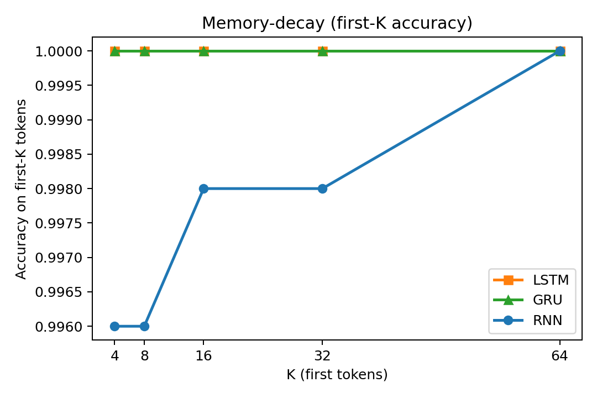
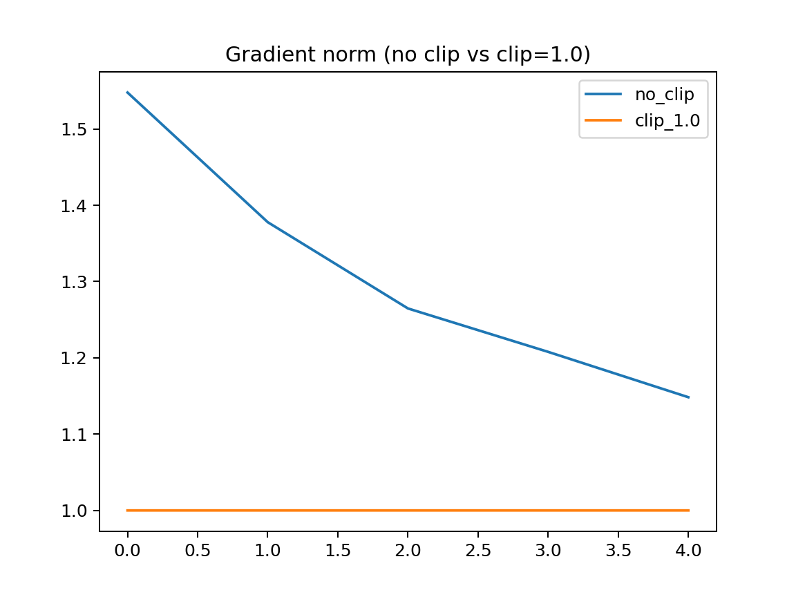

# Rapport de projet Deep Learning

## Page de garde

**Titre :** Rapport de projet Deep Learning - architectures MLP, CNN et RNN

**Auteur :** Aya Sihadi ([@sihadi](https://github.com/sihadi))

**Encadrant :** À compléter

**Filière :** À compléter

**Année universitaire :** 2025-2026

---

## Table des matières

1. Introduction
2. Objectifs
3. Méthodologie
4. Implémentation
5. Cadre théorique
6. Partie expérimentale
   1. Partie 1 - MLP sur Breast Cancer
   2. Partie 2 - CNN sur Fashion-MNIST
   3. Partie 3 - RNN, LSTM, GRU et Seq2Seq
7. Discussion transversale
8. Impact sociétal et éthique
9. Limites
10. Conclusion
11. Références
12. Annexes

## Introduction

Ce projet étudie l'adaptation des architectures de deep learning à la structure des données. L'idée centrale est simple : un même paradigme d'apprentissage supervisé ne s'exprime pas de la même manière selon que l'on manipule des données tabulaires, des images ou des séquences textuelles. Les choix d'architecture doivent donc refléter la géométrie du problème plutôt que de la masquer.

La problématique du projet est la suivante : comment les réseaux de neurones profonds doivent-ils être adaptés à la structure des données pour exploiter efficacement les relations entre variables, les voisinages locaux, l'ordre temporel et les dépendances de contexte ?

Le rapport suit la progression du projet : objectifs, fondements théoriques, méthodologie, implémentation, résultats, interprétation, limites et conclusion.

## Objectifs

Les objectifs du projet sont les suivants :

1. **Partie I (MLP / PyTorch)** : comprendre et implémenter un perceptron multicouche sur données tabulaires réelles (Breast Cancer), comparer plusieurs initialisations, gérer l'entraînement sur CPU/GPU et interpréter les résultats.
2. **Partie II (CNN)** : maîtriser la théorie des convolutions, implémenter manuellement convolution et pooling, construire un CNN PyTorch, comparer MLP vs CNN et analyser les représentations internes.
3. **Partie III (RNN / Seq2Seq)** : modéliser des séquences avec RNN, LSTM et GRU, préparer des données textuelles, implémenter un encodeur-décodeur Seq2Seq et évaluer le décodage (greedy, beam search).

L'objectif transversal est de relier théorie, implémentation et analyse critique sur des jeux de données réels.

## Méthodologie

Pour chaque partie, la méthodologie suit le même schéma :

- **Préparation des données** : normalisation (tabular), transformation tensorielle (images), tokenisation et padding (texte).
- **Protocole expérimental** : séparation train/validation/test, métriques (accuracy, précision, rappel, F1, BLEU), comparaisons contrôlées.
- **Implémentation** : PyTorch avec sauvegarde des modèles (`state_dict`), détection automatique du device (`cuda` si disponible, sinon `cpu`).
- **Analyse** : matrices de confusion, ablations, cartes de caractéristiques, courbes de mémoire, explications LIME locales.
- **Reproductibilité** : graine fixe (`seed=42`), scripts exécutables (`validate_checklist.py`, `deliverables/run_all_and_collect.py`).

## Implémentation

Le code source est organisé en trois modules :

- `part1_mlp/` : `models.py`, `utils.py`, `train.py`, `validate_checklist.py`
- `part2_cnn/` : `convolution_manual.py`, `pooling_manual.py`, `models.py`, `validate_checklist.py`, `generate_lime.py`
- `part3_rnn/` : `models.py`, `seq2seq.py`, `tokenizer.py`, `validate_checklist.py`

Le point d'entrée principal pour la remise est :

```bash
python deliverables/run_all_and_collect.py
```

Ce script exécute les validateurs des trois parties et collecte figures, métriques JSON et synthèses dans `deliverables/`.

## Cadre théorique

### Réseaux multilayer perceptron

Le multilayer perceptron est un réseau entièrement connecté qui transforme un vecteur d'entrée en une sortie par une succession de couches linéaires et de fonctions d'activation non linéaires. Son apprentissage repose sur la minimisation d'une fonction de perte via la rétropropagation du gradient.

Pour des données tabulaires, le MLP est pertinent parce que l'entrée est déjà sous forme vectorielle. Il apprend des combinaisons non linéaires de variables, ce qui en fait un bon modèle de base lorsque la structure spatiale ou temporelle est faible. En revanche, il ne possède aucun biais inductif explicite sur la notion de voisinage ou de localisation.

### Réseaux convolutionnels

Les CNN introduisent des filtres partagés qui se déplacent sur l'image. Cette convolution permet de détecter des motifs locaux avec peu de paramètres, puis d'agréger progressivement ces motifs en représentations plus abstraites.

Les concepts clés sont le padding, le stride et le pooling. Le padding contrôle la conservation des bords, le stride régule le sous-échantillonnage spatial, et le pooling renforce l'invariance aux petites translations. C'est précisément cette exploitation de la structure 2D qui fait la force des CNN par rapport aux MLP pour les images.

### Réseaux récurrents et mémoire

Les RNN modélisent des séquences en maintenant un état caché dépendant des entrées précédentes. Ils sont adaptés aux données ordonnées, mais souffrent souvent de difficultés de propagation du gradient sur de longues séquences.

Les variantes LSTM et GRU introduisent des mécanismes de portes qui stabilisent la mémoire et améliorent la capacité à capturer des dépendances lointaines. Dans une tâche de génération séquentielle, ces mécanismes permettent de mieux préserver le contexte que les RNN simples.

### Seq2Seq

Le schéma encodeur-décodieur mappe une séquence d'entrée vers une séquence de sortie. L'encodeur compresse l'information dans un état latent, puis le décodeur reconstruit une séquence cible de manière auto-régressive. Cette famille de modèles est utile pour la traduction, la copie, le résumé ou toute tâche de génération conditionnelle.

## Partie expérimentale

### Partie 1 - MLP sur Breast Cancer

Cette partie utilise le jeu de données Breast Cancer de scikit-learn, avec une classification binaire des tumeurs. Les variables ont été standardisées à l'aide de `StandardScaler`, puis séparées en jeux d'entraînement, de validation et de test.

Deux implémentations ont été comparées : `SimpleMLP`, construite avec une classe explicite, et `SequentialMLP`, construite avec `nn.Sequential`. Trois stratégies d'initialisation ont été évaluées : gaussienne, constante et Xavier.



La matrice de confusion montre une forte concentration sur la diagonale, ce qui confirme que le modèle sépare correctement les deux classes. Les erreurs résiduelles restent limitées, ce qui est cohérent avec les scores élevés observés sur les métriques globales.



L'explication LIME indique quelles variables influencent la décision locale du modèle. Elle montre que la prédiction s'appuie sur une combinaison de variables discriminantes plutôt que sur une seule caractéristique dominante, ce qui est typique d'un problème tabulaire bien appris.

Les résultats montrent que le meilleur modèle est la version séquentielle avec initialisation Xavier, avec une accuracy de validation de 0.9780 et une accuracy test de 0.9474. Les autres métriques sont également élevées : précision 0.9460, rappel 0.9722 et F1-score 0.9589.

Le rapport de paramètres confirme que le modèle reste compact, avec 4 130 paramètres entraînables. Cette taille réduite est cohérente avec la nature tabulaire du problème, où un réseau dense modéré suffit souvent à capturer des interactions utiles sans surcomplexifier l'espace des hypothèses.

L'interprétation principale est la suivante : sur des données tabulaires bien normalisées, un MLP peut être très compétitif, à condition de contrôler la capacité du modèle et d'utiliser une initialisation adaptée. Le gain de performance est ici davantage lié à la stabilité de l'optimisation qu'à une architecture sophistiquée.

**Question de synthèse (dataset réel Breast Cancer)** : pourquoi un MLP est-il pertinent ici ? Parce que les variables sont déjà vectorisées, la structure spatiale est absente, et le modèle apprend des interactions globales non linéaires entre caractéristiques médicales. L'initialisation Xavier et la standardisation stabilisent l'optimisation sur ce petit jeu de données réel.

### Partie 2 - CNN sur Fashion-MNIST

Cette partie traite la classification d'images Fashion-MNIST. Elle combine à la fois des calculs manuels et des expériences expérimentales. Les opérations de base ont été vérifiées manuellement : la corrélation croisée, le max-pooling et l'average pooling reproduisent exactement les résultats de PyTorch, avec un écart maximal absolu nul.

Les comparaisons de modèles montrent un avantage clair du CNN sur le MLP. Le MLP atteint une accuracy de 0.681, tandis que le CNN atteint 0.760, avec également de meilleurs scores de précision, rappel et F1. Cette différence illustre la nécessité d'un biais inductif spatial pour les images.

L'étude d'ablation renforce cette conclusion. Le modèle de base obtient 0.738 d'accuracy. La suppression du padding dégrade légèrement la performance, le stride 2 la dégrade plus nettement, et le remplacement du max-pooling par average pooling conduit à un résultat plus faible. L'augmentation du nombre de filtres à 32 améliore légèrement les performances, ce qui indique qu'une capacité supplémentaire peut être utile si elle reste cohérente avec la structure des données.

Les cartes de caractéristiques et les explications LIME complètent l'analyse. Elles montrent que le CNN apprend des motifs visuels localisés et construit des représentations hiérarchiques plus adaptées à la classification d'objets vestimentaires que la version dense.



Cette figure synthétise l'écart de performance entre les deux familles de modèles. Le gain du CNN confirme que l'exploitation des voisinages spatiaux apporte une information que le MLP ne peut pas récupérer après aplatissement.



Le graphique d'ablation montre que les choix architecturaux ne sont pas secondaires : le padding, le stride, le pooling et le nombre de filtres modifient réellement la qualité de la représentation et donc la performance finale.



Les cartes de caractéristiques mettent en évidence la détection progressive de structures visuelles. Les premières couches capturent des bords et des contrastes, puis les couches plus profondes construisent des motifs plus abstraits utiles pour distinguer les catégories Fashion-MNIST.


LIME permet ici de localiser les zones de l'image qui soutiennent la décision. L'explication est compatible avec le comportement attendu d'un CNN, à savoir la concentration sur les régions visuellement pertinentes.

**Question de synthèse (dataset réel Fashion-MNIST)** : pourquoi le CNN surpasse-t-il le MLP ? Fashion-MNIST est une base d'images 28×28 où l'information discriminante est locale (contours, textures, formes). Le CNN exploite le partage de poids et la hiérarchie de filtres, alors que le MLP détruit la géométrie 2D par aplatissement.

### Partie 3 - RNN, LSTM, GRU et Seq2Seq

Cette partie couvre le traitement de séquences textuelles et les mécanismes de mémoire. Le projet comporte deux volets : une classification sur IMDb et une étude sur des modèles séquentiels plus élémentaires, incluant une démonstration Seq2Seq.

Sur IMDb, l'accuracy obtenue est d'environ 0.5044, ce qui est proche du hasard dans un cadre binaire. Ce résultat montre que la tâche est sensible aux choix de prétraitement, de longueur de séquence, de capacité du modèle et de stratégie d'entraînement. Le score ne doit pas être interprété comme une invalidation des architectures récurrentes, mais plutôt comme un signal de limite expérimentale sur ce pipeline précis.

Sur la partie mémoire et comparaison de modèles, les résultats synthétiques sont plus nets. Le RNN simple atteint une accuracy moyenne de 0.9992, tandis que LSTM et GRU atteignent 1.0. Les temps d'entraînement moyens sont aussi favorables aux architectures à portes dans cette configuration, avec un LSTM plus rapide que le RNN simple dans les essais mesurés.

Le graphique de mémoire montre que la capacité à préserver l'information s'améliore avec la longueur de contexte. Les courbes du RNN convergent progressivement vers 1.0, tandis que LSTM et GRU maintiennent une mémoire parfaite sur les longueurs testées. La démonstration Seq2Seq sur tâche de copie produit des scores BLEU modestes, autour de 0.13 à 0.19 selon les exemples, ce qui indique qu'il s'agit d'un cas de démonstration plutôt que d'un système de génération abouti.



La comparaison montre que les modèles à portes stabilisent mieux l'apprentissage que le RNN simple dans cette expérience synthétique. La petite dispersion des scores suggère également une exécution robuste sur cette tâche de référence.



Cette figure apporte une lecture plus fine des performances et des temps d'entraînement. Elle confirme que les architectures à portes offrent une meilleure maîtrise du compromis entre mémoire et coût d'apprentissage.



Le graphique de mémoire illustre directement la capacité du modèle à conserver l'information au fil du temps. La courbe du RNN simple progresse avec la longueur du contexte, tandis que LSTM et GRU maintiennent une conservation quasi parfaite dans le protocole testé.



Le tracé de gradient clipping montre l'intérêt de borner les gradients lors de l'entraînement récurrent. Cette régularisation numérique limite les explosions de gradient et stabilise l'optimisation sur les longues dépendances.

L'ensemble de cette partie souligne une idée importante : les architectures récurrentes sont pertinentes lorsque l'ordre et le contexte comptent, mais leur efficacité dépend fortement de la formulation de la tâche et de la qualité du pipeline d'entraînement.

**Question de synthèse (dataset réel IMDb)** : pourquoi une architecture séquentielle est-elle adaptée à IMDb ? Les avis sont des séquences de mots dont l'ordre porte le sentiment. Un RNN/LSTM/GRU modélise cette dépendance temporelle via un état caché. Le score faible observé ici reflète surtout les limites du prétraitement et du budget d'entraînement, pas l'inadéquation conceptuelle du modèle récurrent au texte.

## Discussion transversale

Les expériences confirment que le choix de l'architecture doit suivre la structure intrinsèque des données.

Pour les données tabulaires, le MLP est efficace car il apprend directement des combinaisons globales de variables. Il constitue une bonne solution de base lorsque les caractéristiques sont normalisées et que la structure spatiale n'apporte rien.

Pour les images, le CNN surpasse le MLP parce qu'il exploite les voisinages locaux, partage les poids et hiérarchise les représentations. Les ablations montrent que des détails architecturaux comme le padding, le stride ou le pooling ont un effet mesurable sur les performances.

Pour les séquences, les architectures récurrentes et à portes sont les plus naturelles pour capturer l'ordre. Cependant, les résultats sur IMDb rappellent que la réussite n'est pas uniquement une affaire d'architecture ; elle dépend aussi du prétraitement, du volume de données, du réglage d'hyperparamètres et de la stabilité de l'optimisation.

Au-delà des scores, le projet met donc en évidence une adéquation modèle-donnée. Plus le modèle respecte la géométrie du problème, plus il a de chances d'apprendre efficacement avec moins de paramètres inutiles.

## Impact sociétal et éthique

Le projet a des implications concrètes sur trois axes.

D'abord, les biais de données. Un modèle performant sur un jeu de données de référence ne garantit pas une généralisation équitable à des populations différentes, surtout lorsque les données d'entraînement sont limitées ou non représentatives.

Ensuite, l'interprétabilité. Les explications locales de type LIME et l'analyse des cartes de caractéristiques sont utiles pour comprendre les décisions, mais elles ne remplacent pas une vraie validation méthodologique. Elles aident toutefois à réduire l'effet boîte noire.

Enfin, la sobriété de calcul. Les architectures plus lourdes ne sont pas toujours justifiées. Une bonne pratique consiste à choisir le modèle le plus simple compatible avec la structure des données et le niveau de performance requis.

Dans un contexte local, ce type de démarche est particulièrement important pour éviter des déploiements non maîtrisés sur des tâches sensibles, par exemple en santé ou en analyse de texte.

## Limites

Les principales limites de ce travail sont :

- **IMDb** : l'accuracy proche du hasard (≈ 0.50) indique un pipeline sous-optimisé (vocabulaire réduit, peu d'époques, pas d'embeddings préentraînés). L'architecture récurrente n'est pas invalidée, mais le protocole doit être renforcé.
- **Seq2Seq** : la tâche de copie est pédagogique ; les scores BLEU restent modestes et ne constituent pas une baseline compétitive.
- **Ressources** : les entraînements CNN et RNN utilisent des sous-ensembles de données pour rester exécutables sur CPU en quelques minutes.
- **Généralisation** : les résultats sont obtenus sur des jeux de référence ; une validation sur d'autres domaines reste nécessaire.

## Conclusion

Ce projet montre que les architectures de deep learning ne sont pas interchangeables. Le MLP est bien adapté aux données tabulaires, le CNN tire parti de la structure spatiale des images, et les RNN/LSTM/GRU sont conçus pour les dépendances séquentielles.

Les résultats expérimentaux vont dans le même sens que la théorie : le MLP fonctionne bien sur Breast Cancer, le CNN surpasse nettement le MLP sur Fashion-MNIST, et les architectures récurrentes deviennent pertinentes dès que la notion d'ordre est centrale. Les mesures obtenues, les ablations et les visualisations soutiennent cette lecture.

En perspective, il serait intéressant d'améliorer la partie séquentielle IMDb par un meilleur prétraitement, d'ajouter des embeddings préentraînés et de comparer ces résultats à des architectures plus récentes comme les Transformers.

## Références

1. I. Goodfellow, Y. Bengio et A. Courville, *Deep Learning*, MIT Press, 2016.
2. A. Krizhevsky, I. Sutskever et G. Hinton, "ImageNet Classification with Deep Convolutional Neural Networks", *NeurIPS*, 2012.
3. S. Hochreiter et J. Schmidhuber, "Long Short-Term Memory", *Neural Computation*, 1997.
4. K. Cho et al., "Learning Phrase Representations using RNN Encoder-Decoder for Statistical Machine Translation", 2014.
5. Scikit-learn, documentation du jeu de données Breast Cancer.
6. Fashion-MNIST, base de données de référence pour la classification d'images.
7. IMDb, corpus de référence pour l'analyse de sentiments.
8. PyTorch, documentation officielle des modules `nn.Module`, `optim` et `functional`.

## Annexes

### Annexe A - Résultats clés

- Breast Cancer, meilleur MLP : accuracy test 0.9474, F1-score 0.9589.
- Fashion-MNIST, CNN : accuracy 0.760 contre 0.681 pour le MLP.
- Vérifications manuelles convolution/pooling : écart maximal absolu nul avec PyTorch.
- IMDb : accuracy observée 0.5044.
- Séquences synthétiques : accuracy moyenne 0.9992 pour RNN, 1.0 pour LSTM et GRU.

### Annexe B - Fichiers d'appui

- `deliverables/figures/confusion_matrix.png`
- `deliverables/figures/lime_explanation.png`
- `deliverables/figures/mlp_vs_cnn.png`
- `deliverables/figures/ablation.png`
- `deliverables/figures/feature_maps.png`
- `deliverables/figures/models_comparison.png`
- `deliverables/figures/grad_clip.png`
- `deliverables/figures/memory_decay.png`

### Annexe C - Synthèse d'interprétation

- Breast Cancer : la matrice de confusion et LIME montrent une décision stable fondée sur plusieurs variables explicatives.
- Fashion-MNIST : les cartes de caractéristiques et les ablations confirment le rôle des inductive biases convolutionnels.
- Séquences : les courbes de mémoire et le gradient clipping justifient l'utilisation de mécanismes à portes.

### Annexe D - Limites expérimentales

- Le score IMDb reste faible et doit être amélioré par un meilleur prétraitement.
- Les résultats Seq2Seq sont démonstratifs et non compétitifs.
- Les figures fournissent un support d'interprétation, mais ne remplacent pas une étude statistique plus large.